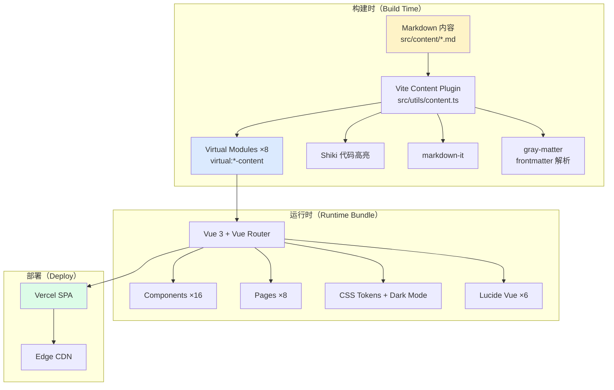
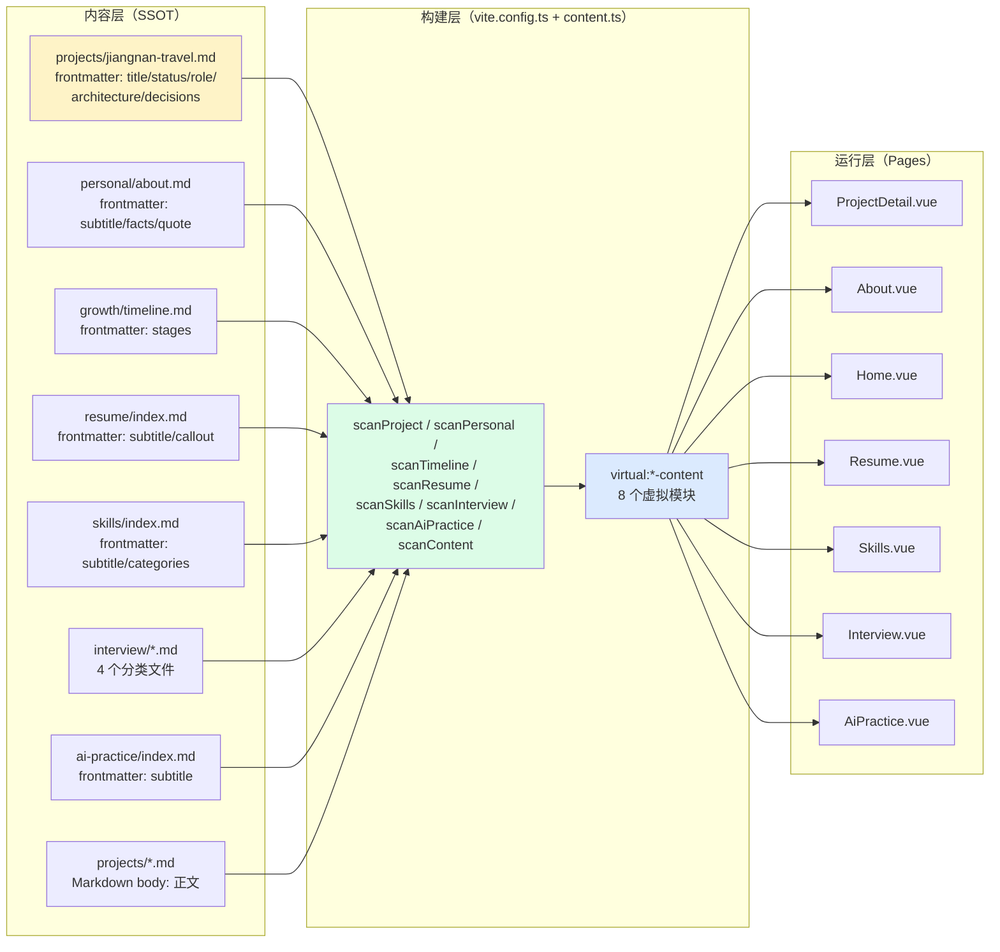
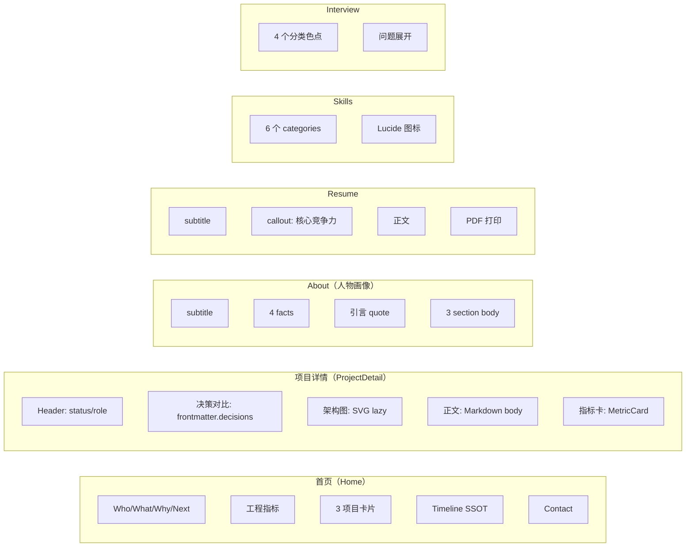
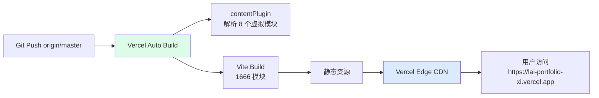

# Architecture（系统架构）

> **本文件是项目系统架构的唯一权威来源（SSOT）。**
> 涵盖：前端架构 / 数据流 / 组件关系 / 页面职责 / 设计系统 / 重要设计原则 / 关键文件说明。
>
> 最后更新：2026-07-18
> 当前版本：v3.5.0（已发布，维护模式）

---

## 1. 架构总览

### 1.1 一句话架构

**纯前端 SPA（Vue 3 + TypeScript + Vite），采用 Markdown SSOT 模式**：所有内容数据以 `src/content/*.md` 为唯一数据源，构建时通过自定义 Vite 插件解析为 8 个虚拟模块，运行时 bundle 零 Markdown 解析开销。

### 1.2 关键架构特征

| 特征 | 实现 | 价值 |
|---|---|---|
| **纯前端** | Vue 3 SPA，无后端、无数据库、无 API | 部署简单（Vercel 静态托管），零服务器成本 |
| **Markdown SSOT** | 8 个虚拟模块在构建时解析 Markdown | 内容与代码解耦，非技术人员可维护内容 |
| **构建时处理** | markdown-it + Shiki 仅在 build 时运行 | 运行时 bundle 极小（gzip ~42 KB） |
| **零运行时 Markdown 解析** | 虚拟模块直接导出解析后的 JS 对象 | 首屏 LCP < 1s（线上 676ms） |
| **设计令牌系统** | CSS Custom Properties + Dark Mode | 视觉一致性 + 主题切换零 JS |
| **组件配额制** | 全站仅 1 个抽象组件（ArchitectureDiagram） | 杜绝过度抽象 |

### 1.3 系统边界



---

## 2. 技术栈

| 层级 | 选型 | 版本 | 用途 |
|---|---|---|---|
| 框架 | Vue 3（`<script setup lang="ts">` + Composition API） | 3.5+ | UI 框架 |
| 语言 | TypeScript（strict: true） | 5.6.3 | 类型安全 |
| 构建 | Vite（含构建时内容插件） | 6.4.3 | 构建 + Dev Server |
| 路由 | Vue Router（createWebHistory） | 4.5+ | SPA 路由 |
| CSS | CSS Custom Properties（设计令牌系统） | — | 样式 + 主题切换 |
| 图标 | Lucide Vue Next | 0.460+ | 仅 6 个图标（Phase 3 引入） |
| 字体 | Inter + JetBrains Mono（Google Fonts） | — | 正文 + 等宽 |
| Markdown 解析 | markdown-it（仅构建时） | 14.3.0 | 内容渲染 |
| Frontmatter | gray-matter（仅构建时） | 4.0.3 | 结构化元数据 |
| 代码高亮 | Shiki（仅构建时，深色主题不随主题切换） | 4.3.1 | 代码块高亮 |
| E2E 测试 | Playwright | 1.48+ | 163 项断言 |
| 部署 | Vercel（SPA rewrites，master 自动部署） | — | 静态托管 + CDN |

**运行时依赖（3 项）**：`vue` / `vue-router` / `lucide-vue-next`
**开发时依赖（9 项）**：`@types/markdown-it` / `@types/node` / `@vitejs/plugin-vue` / `gray-matter` / `markdown-it` / `playwright` / `shiki` / `typescript` / `vite` / `vue-tsc`

**运行时 bundle**：1666 模块，gzip 主包 ~42.26 KB

> **详细的禁止事项与替代原则见 [AI_RULES.md §4](AI_RULES.md)。**

---

## 3. 目录结构

```
个人网页/
├── src/
│   ├── assets/
│   │   └── projects/              # 3 个项目架构图 SVG（构建时 import.meta.glob lazy 加载）
│   │       ├── exam-system.svg
│   │       ├── jiangnan-travel.svg
│   │       └── love-letter.svg
│   ├── components/
│   │   ├── common/                # 全局通用组件（4 个）
│   │   │   ├── BackToTop.vue
│   │   │   ├── Footer.vue
│   │   │   ├── NavBar.vue
│   │   │   └── ThemeToggle.vue
│   │   ├── home/                  # 首页专用组件（4 个）
│   │   │   ├── ContactSection.vue
│   │   │   ├── HeroSection.vue
│   │   │   ├── ProjectCard.vue
│   │   │   └── TimelineSection.vue
│   │   ├── interview/             # 面试页专用组件（2 个）
│   │   │   ├── InterviewCategory.vue
│   │   │   └── InterviewQuestion.vue
│   │   └── project/               # 项目详情页专用组件（6 个）
│   │       ├── ArchitectureDiagram.vue   # ★ 全站唯一抽象组件（v3.0.0 配额）
│   │       ├── DecisionSection.vue       # Phase 5 重构：frontmatter.decisions 驱动
│   │       ├── MarkdownContent.vue       # Markdown 渲染容器
│   │       ├── MetricCard.vue            # 指标卡片
│   │       ├── ProjectHeader.vue         # RC2.1 提取
│   │       └── ProjectNav.vue            # 项目内导航
│   ├── composables/               # 组合式函数（2 个）
│   │   ├── useScrollReveal.ts     # Phase 0：Scroll Reveal 动画
│   │   └── useTheme.ts            # 主题切换（Dark Mode）
│   ├── content/                   # ★ Markdown SSOT 数据源（14 个文件）
│   │   ├── ai-practice/index.md   # AI 实践页内容
│   │   ├── decisions/             # 项目决策记录（3 个，已迁移到 projects/*.md frontmatter.decisions）
│   │   │   ├── exam-system.md
│   │   │   ├── jiangnan-travel.md
│   │   │   └── love-letter.md
│   │   ├── growth/timeline.md     # Timeline SSOT（RC1 改造）
│   │   ├── interview/             # 面试问题（4 个分类）
│   │   │   ├── exam-system.md
│   │   │   ├── general.md
│   │   │   ├── jiangnan-travel.md
│   │   │   └── love-letter.md
│   │   ├── personal/about.md      # About 页内容（RC3 重构为人物画像）
│   │   ├── projects/              # 项目详情（3 个）
│   │   │   ├── exam-system.md
│   │   │   ├── jiangnan-travel.md
│   │   │   └── love-letter.md
│   │   ├── resume/index.md        # Resume 内容（含 callout）
│   │   └── skills/index.md        # Skills 内容（RC4 重构为 categories）
│   ├── layouts/
│   │   └── DefaultLayout.vue      # 默认布局（NavBar + RouterView + Footer）
│   ├── pages/                     # 路由页面（8 个）
│   │   ├── Home.vue               # /
│   │   ├── About.vue              # /about
│   │   ├── AiPractice.vue         # /ai-practice
│   │   ├── Interview.vue          # /interview
│   │   ├── NotFound.vue           # /:pathMatch(.*)*
│   │   ├── ProjectDetail.vue      # /projects/:slug
│   │   ├── Resume.vue             # /resume
│   │   └── Skills.vue             # /skills
│   ├── router/
│   │   └── index.ts               # 路由配置（7 条路由 + 404）
│   ├── styles/                    # 全局样式（4 个）
│   │   ├── code-theme.css         # Shiki 代码块主题
│   │   ├── global.css             # 全局基础样式 + .page__header / .page__subtitle 工具类
│   │   ├── motion.css             # Phase 0：Scroll Reveal 动画系统
│   │   └── tokens.css             # ★ 设计令牌系统（颜色/间距/字体/阴影/圆角）
│   ├── types/                     # TypeScript 类型定义（9 个）
│   │   ├── ai-practice.ts
│   │   ├── contact.ts
│   │   ├── content.ts             # 虚拟模块类型
│   │   ├── decision.ts            # Phase 5：方案对比类型
│   │   ├── interview.ts
│   │   ├── personal.ts            # RC3：PersonalFact 类型
│   │   ├── project.ts             # RC2：status / role / architecture 字段
│   │   ├── resume.ts              # Phase 7：callout 字段
│   │   ├── skills.ts              # RC4：SkillCategory 类型
│   │   └── timeline.ts            # RC1：TimelineStage 类型
│   └── utils/
│       ├── content.ts             # ★ Vite 内容插件 + 8 个 scan 函数（核心文件）
│       └── markdown.ts            # markdown-it + Shiki 配置
├── public/                        # 静态资源（不经过构建）
│   ├── favicon.svg
│   ├── robots.txt                 # RC7：SEO 基础
│   └── sitemap.xml                # RC7：9 条路由
├── docs/                          # 文档（详见 §6 关键文件）
│   ├── 架构确认文档-v1.2.md       # ★ 最高权威文档
│   ├── archive/v3.5-history/      # 历史归档（phase/release/task/design）
│   └── assets/                    # 架构图源文件 + 项目截图
├── index.html                     # SEO meta + Google Fonts preconnect
├── package.json                   # 版本号 3.5.0 + 脚本
├── tsconfig.json                  # TypeScript strict 配置
├── vite.config.ts                 # ★ Vite 配置 + contentPlugin + Git Last Updated/Commit 注入
├── vercel.json                    # Vercel SPA rewrites
├── AI_RULES.md                    # 项目特定 AI 协作约束
├── HANDOFF.md                     # ★ 唯一入口文档
├── PROJECT_STATUS.md              # 当前完成情况
├── DEVELOPMENT_HISTORY.md         # 开发历史
├── ROADMAP.md                     # 未来规划
├── TECHNICAL_DEBT.md              # 技术债
└── release-gate-task-005.mjs      # ★ Playwright E2E 测试（163 项断言）
```

---

## 4. 数据流（Markdown SSOT 模式）

### 4.1 核心数据流



### 4.2 8 个虚拟模块

| # | 虚拟模块名 | 数据源 | 消费者 | 引入阶段 |
|---|---|---|---|---|
| 1 | `virtual:content` | `src/content/projects/*.md`（Markdown body） | ProjectDetail.vue | Task 003 |
| 2 | `virtual:project-detail` | `src/content/projects/*.md`（frontmatter） | ProjectDetail.vue | Task 003 |
| 3 | `virtual:interview-content` | `src/content/interview/*.md` | Interview.vue | Task 004 |
| 4 | `virtual:ai-practice-content` | `src/content/ai-practice/index.md` | AiPractice.vue | Task 004 |
| 5 | `virtual:skills-content` | `src/content/skills/index.md` | Skills.vue | Task 005 |
| 6 | `virtual:personal-content` | `src/content/personal/about.md` | About.vue | Task 005 |
| 7 | `virtual:resume-content` | `src/content/resume/index.md` | Resume.vue | Task 008 |
| 8 | `virtual:timeline-content` | `src/content/growth/timeline.md` | Home.vue | RC1 |

**虚拟模块数已定型，不再新增**（硬约束）。

### 4.3 Markdown SSOT 模式详解

**核心思想**：所有内容数据（项目信息、时间线、技能、面试题、简历、About 等）以 `src/content/*.md` 为**唯一数据源**，Markdown 文件的 frontmatter（YAML 元数据）+ body（Markdown 正文）在构建时被解析为 JS 对象，通过虚拟模块暴露给页面组件。

**关键约束**：
- ❌ 禁止在组件中硬编码内容数据
- ❌ 禁止创建第二个数据源（如 JSON / TS 常量）
- ❌ 禁止运行时解析 Markdown（必须构建时处理）
- ✅ 内容修改只需编辑 `.md` 文件，无需改代码

**示例数据流（Resume callout）**：
```
src/content/resume/index.md (frontmatter.callout: "后端 · 分布式 · 工程")
  ↓ scanResume() 透传
src/utils/content.ts → ResumeContent.callout
  ↓ virtual:resume-content 虚拟模块
src/pages/Resume.vue (template + scoped CSS)
```

---

## 5. 组件关系

### 5.1 组件分类

```mermaid
graph TB
    subgraph "Layout"
        DL[DefaultLayout.vue]
        NB[NavBar.vue]
        FT[Footer.vue]
        TT[ThemeToggle.vue]
        BT[BackToTop.vue]
    end

    subgraph "Pages"
        H[Home.vue]
        A[About.vue]
        R[Resume.vue]
        S[Skills.vue]
        I[Interview.vue]
        AP[AiPractice.vue]
        PD[ProjectDetail.vue]
        NF[NotFound.vue]
    end

    subgraph "Home Components"
        HS[HeroSection]
        PC[ProjectCard]
        TS[TimelineSection]
        CS[ContactSection]
    end

    subgraph "Project Components"
        PH[ProjectHeader]
        MC[MarkdownContent]
        DS[DecisionSection]
        AD[ArchitectureDiagram<br/>★ 唯一抽象组件]
        MN[ProjectNav]
        MT[MetricCard]
    end

    subgraph "Interview Components"
        IC[InterviewCategory]
        IQ[InterviewQuestion]
    end

    DL --> NB
    DL --> FT
    DL --> TT
    DL --> BT
    DL --> H
    DL --> A
    DL --> R
    DL --> S
    DL --> I
    DL --> AP
    DL --> PD
    DL --> NF

    H --> HS
    H --> PC
    H --> TS
    H --> CS

    PD --> PH
    PD --> MC
    PD --> DS
    PD --> AD
    PD --> MN
    PD --> MT

    I --> IC
    I --> IQ

    style AD fill:#fef3c7
    style DL fill:#dbeafe
```



### 5.2 组件清单（16 个）

| 分类 | 组件 | 职责 | 配额状态 |
|---|---|---|---|
| Layout | `DefaultLayout.vue` | 全局布局（NavBar + RouterView + Footer） | — |
| common | `NavBar.vue` | 顶部导航 + 主题切换按钮 | — |
| common | `Footer.vue` | 底部 Footer（含 Git Last Updated + Grid Pattern） | — |
| common | `ThemeToggle.vue` | 主题切换按钮（封装在 NavBar） | — |
| common | `BackToTop.vue` | 返回顶部按钮 | — |
| home | `HeroSection.vue` | 首页 Hero（Who / What / Why / Next + 工程指标 + Grid Pattern） | — |
| home | `ProjectCard.vue` | 项目卡片（首页 3 个项目预览） | — |
| home | `TimelineSection.vue` | 时间线（从 timeline.md SSOT 读取） | — |
| home | `ContactSection.vue` | 联系方式（GitHub） | — |
| project | `ProjectHeader.vue` | 项目详情页 Header（status / role 从 frontmatter） | — |
| project | `MarkdownContent.vue` | Markdown 渲染容器 | — |
| project | `DecisionSection.vue` | 方案对比（Phase 5 重构：frontmatter.decisions + Amber Accent Line） | — |
| project | **`ArchitectureDiagram.vue`** | **★ 全站唯一抽象组件**（v3.0.0 配额，B1 方案） | **1/2 已用** |
| project | `ProjectNav.vue` | 项目内导航 | — |
| project | `MetricCard.vue` | 指标卡片 | — |
| interview | `InterviewCategory.vue` | 面试分类容器 | — |
| interview | `InterviewQuestion.vue` | 面试问题项 | — |

### 5.3 组件配额制

**硬约束**：全站新增抽象组件配额上限 **2 个**（RC2 用户指令）。

| 配额使用 | 组件 | 引入阶段 | 状态 |
|---|---|---|---|
| 1/2 | `ArchitectureDiagram.vue` | RC2.2 | ✅ 已用 |
| 2/2 | — | — | ⏸️ 剩余 1 个（v3.5.0 后作废） |

**配额已耗尽**：v3.5.0 发布后进入维护模式，剩余 1 个配额**作废**，不再允许新增抽象组件。

---

## 6. 页面职责与路由

### 6.1 路由表

| 路径 | 页面 | 虚拟模块 | 主要职责 |
|---|---|---|---|
| `/` | Home.vue | `virtual:timeline-content` | Hero + 项目卡片 + 时间线 + 联系方式 |
| `/about` | About.vue | `virtual:personal-content` | 人物画像（subtitle + facts + 引言 + body） |
| `/resume` | Resume.vue | `virtual:resume-content` | 简历（callout + body + PDF 打印） |
| `/skills` | Skills.vue | `virtual:skills-content` | 技能分类卡片（6 个 categories） |
| `/interview` | Interview.vue | `virtual:interview-content` | 面试问题（4 个分类 + 色点） |
| `/ai-practice` | AiPractice.vue | `virtual:ai-practice-content` | AI 实践 |
| `/projects/:slug` | ProjectDetail.vue | `virtual:project-detail` + `virtual:content` | 项目详情（Header + 决策 + 架构图 + 正文） |
| `/:pathMatch(.*)*` | NotFound.vue | — | 404 |

### 6.2 页面职责矩阵



### 6.3 页面信息分层原则

- **Hero 信息层级**：Who / What / Why / Next + Engineering Metrics（无营销文案）
- **About = 人物画像**，不是 Resume：facts ≤4 项长期稳定信息，不放易变数据
- **Resume = 简历**：含 callout 核心竞争力 + PDF 打印
- **ProjectDetail = 工程叙事**：问题 → 方案对比 → 选择理由 → 实现 → 验证 → 复盘
- **页面间不重复信息**：Hero 不放联系方式细节（在 Contact section），About 不放项目数（在 Hero 工程指标）

---

## 7. 状态管理

### 7.1 为什么不用 Pinia / Vuex

**决策**：不引入任何状态管理库，使用 Vue 3 Composition API 的 `ref` / `reactive` + props / provide-inject。

**理由**：
1. **页面间无共享状态**：每个页面独立从虚拟模块读取数据，无跨页面状态
2. **主题状态简单**：`useTheme` composable + `data-theme` HTML 属性即可
3. **路由参数即状态**：`/projects/:slug` 的 slug 通过 `useRoute()` 获取
4. **YAGNI 原则**：3 个运行时依赖已足够，不为想象中的需求引入 Pinia

### 7.2 主题系统（Dark Mode）

**实现**：CSS Custom Properties + `data-theme` HTML 属性，**零 JS 切换**（仅切换属性，样式由 CSS 处理）。

```typescript
// src/composables/useTheme.ts
const theme = ref<'light' | 'dark'>('light')
const toggleTheme = () => {
  theme.value = theme.value === 'light' ? 'dark' : 'light'
  document.documentElement.setAttribute('data-theme', theme.value)
}
```

**Dark Mode 关键设计**：
- Amber 强调色自动提亮：`#d97706` → `#f59e0b`
- SVG 架构图视为"亮色卡片"，用防御性样式适配（不修改 SVG 内容）
- 代码块始终深色（Shiki 深色主题，不随主题切换）

---

## 8. 设计系统

### 8.1 Design Token 系统

**SSOT 文件**：[src/styles/tokens.css](src/styles/tokens.css)

```css
:root {
  /* 颜色 - 亮色模式（默认） */
  --color-bg: #f8f9fa;
  --color-surface: #ffffff;
  --color-border: #e2e8f0;
  --color-text-primary: #1a202c;
  --color-text-secondary: #4a5568;
  --color-text-muted: #a0aec0;
  --color-accent: #d97706;          /* Amber */
  --color-accent-light: #fef3c7;
  --color-accent-strong: #b45309;
  --color-on-accent: #ffffff;

  /* 间距阶梯 */
  --space-1: 4px;
  --space-2: 8px;
  --space-3: 12px;
  --space-4: 16px;
  --space-5: 20px;
  --space-6: 24px;
  --space-8: 32px;
  --space-10: 40px;
  --space-12: 48px;
  --space-16: 64px;
  --space-20: 80px;

  /* 字体 */
  --font-sans: 'Inter', 'Noto Sans SC', -apple-system, sans-serif;
  --font-mono: 'JetBrains Mono', 'Fira Code', 'Consolas', monospace;

  /* 圆角 */
  --radius-sm: 4px;   /* 标签 */
  --radius-md: 8px;   /* 卡片 / 按钮 */
  --radius-lg: 12px;  /* 大卡片 */

  /* 阴影 */
  --shadow-sm: 0 1px 2px rgba(0, 0, 0, 0.05);
  --shadow-md: 0 4px 6px rgba(0, 0, 0, 0.1);
}

[data-theme="dark"] {
  --color-bg: #0f172a;
  --color-surface: #1e293b;
  --color-border: #334155;
  --color-text-primary: #f1f5f9;
  --color-text-secondary: #94a3b8;
  --color-text-muted: #64748b;
  --color-accent: #f59e0b;          /* Amber 提亮 */
}
```

**使用规则**：
- ❌ 禁止硬编码颜色值（必须用 `var(--color-xxx)`）
- ❌ 禁止新增 Design Token（v3.5.0 冻结）
- ✅ 强调色只用于：链接、按钮、技术标签、关键数字、Accent Line
- ✅ 一页最多 3 处强调色

### 8.2 Signature Visual 6 元素（v3.5.0 已全部完成）

| Signature | 描述 | 应用位置 | 配额 | 状态 |
|---|---|---|---|---|
| S1 | Number Prefix（`//` eyebrow） | 全站 section header | — | ✅ |
| S2 | Mono Eyebrow（`.mono` class） | 6 个页面 eyebrow | — | ✅ |
| S3 | Amber Accent Line | DecisionSection / About / Resume | **3/3 耗尽** | ✅ |
| S4 | Grid Pattern Underlay | Hero / Footer | **2/2 耗尽** | ✅ |
| S5 | Code Comment Style（`//` 注释） | 全站代码注释 | — | ✅ |
| S9 | Underline Reveal（Footer link hover） | Footer link `::after` | — | ✅ |

**硬约束**：S3 和 S4 配额已耗尽，**后续不得新增第 4 处 Amber Accent Line 或第 3 处 Grid Pattern**。

### 8.3 全局工具类（CSS utility，非组件）

**SSOT 文件**：[src/styles/global.css](src/styles/global.css)

- `.page__header` — 统一页面 Header 模式（RC4 引入）
- `.page__subtitle` — 统一页面副标题
- `.mono` — 等宽字体类（S2 Mono Eyebrow）

**设计意图**：用 CSS utility 而非新组件提供统一模式，避免消耗组件配额。

---

## 9. 构建与部署

### 9.1 Vite 配置（[vite.config.ts](vite.config.ts)）

**核心功能**：
1. `contentPlugin()` — 自定义 Vite 插件，构建时解析 Markdown 为 8 个虚拟模块
2. `define` 注入全局常量：
   - `__LAST_UPDATED__` — Git 最后提交时间（ISO 8601），Vercel 环境无 git 时 fallback 到 build time
   - `__GIT_COMMIT__` — Git 短 hash（7 位），Vercel 环境无 git 时 fallback 到 `'dev'`
3. `resolve.alias` — `@` 指向 `./src`

### 9.2 部署架构（Vercel）



**配置文件**：[vercel.json](vercel.json) — SPA rewrites（所有路由指向 index.html）

**线上性能基线**（2026-07-18 实测）：
- LCP: 676ms ✅
- FCP: < 1500ms ✅
- CLS: 0.3756 ❌（baseline 问题，详见 [TECHNICAL_DEBT.md](TECHNICAL_DEBT.md)）
- 控制台错误: 0 ✅
- 7 路由 HTTP 200: ✅

---

## 10. 测试架构

### 10.1 E2E 测试（Playwright）

**SSOT 文件**：[release-gate-task-005.mjs](release-gate-task-005.mjs)

- **断言数**：163 项（全部通过）
- **覆盖范围**：
  - 7 个路由可访问性
  - 关键元素存在性（Hero / ProjectCard / Timeline / Contact 等）
  - 主题切换
  - 键盘导航
  - Dark Mode
  - Phase 7 专项断言（18 项，Test 19）
- **运行命令**：`npm test`

### 10.2 验证脚本（.mjs 文件）

| 脚本 | 用途 | 阶段 |
|---|---|---|
| `release-gate-task-005.mjs` | 主测试套件（163 项断言） | 持续维护 |
| `phase7-consistency-verify.mjs` | 全站一致性验证（26 项） | Phase 7 |
| `phase7-perf-verify.mjs` | 性能验证（17 项） | Phase 7 |
| `phase7-prod-verify.mjs` | 线上性能验证 | Phase 7 |
| `phase5-special-verify.mjs` | Phase 5 专项验证 | Phase 5 |
| `phase5-cls-baseline.mjs` | CLS 基线验证 | Phase 5 |
| `phase6-a11y-verify.mjs` | Phase 6 a11y 验证 | Phase 6 |

---

## 11. 重要设计原则（Architecture Decisions）

### 11.1 为什么用当前架构

| 决策 | 理由 | 替代方案（已拒绝） |
|---|---|---|
| **Vue 3 + TypeScript strict** | 类型安全 + 组合式 API + 生态成熟 | React（用户更熟悉 Vue）/ Svelte（生态小） |
| **Vite 构建时内容插件** | 运行时零解析开销，bundle 极小 | 运行时 markdown-it（首屏慢）/ CMS（过度工程） |
| **Markdown SSOT** | 内容与代码解耦，非技术人员可维护 | JSON / TS 常量（无 Markdown 表达力）/ 数据库（无后端） |
| **纯前端 SPA** | 部署简单，零服务器成本 | SSR/SSG（过度工程）/ 后端服务（无需求） |
| **CSS Custom Properties** | 主题切换零 JS，浏览器原生支持 | Tailwind（运行时大）/ CSS-in-JS（运行时开销） |
| **组件配额制** | 强制权衡抽象与冗余 | 无限制（导致过度抽象） |

### 11.2 为什么不用某些方案

| 方案 | 拒绝理由 |
|---|---|
| **Element Plus / Naive UI** | 第三方 UI 库与 Developer Academic 风格冲突，且增加 bundle |
| **Tailwind CSS** | utility-first 与设计令牌系统冲突 |
| **Pinia / Vuex** | 无跨页面共享状态，YAGNI |
| **Nuxt / Next.js** | SSR/SSG 过度工程，纯 SPA 足够 |
| **GSAP / 动画库** | CSS transition + `useScrollReveal` composable 足够 |
| **运行时 Markdown 解析** | 首屏性能差，构建时处理更优 |
| **数据库 / 后端 API** | 内容静态，无需动态查询 |

### 11.3 SSOT（Single Source of Truth）文件清单

| 数据 / 信息 | SSOT 文件 | 修改风险 |
|---|---|---|
| 项目详情内容 | `src/content/projects/*.md` | 低（仅内容修改） |
| 时间线数据 | `src/content/growth/timeline.md` | 低（仅内容修改） |
| About 页内容 | `src/content/personal/about.md` | 低（仅内容修改） |
| Resume 内容 | `src/content/resume/index.md` | 低（仅内容修改） |
| Skills 内容 | `src/content/skills/index.md` | 低（仅内容修改） |
| Interview 内容 | `src/content/interview/*.md` | 低（仅内容修改） |
| AI Practice 内容 | `src/content/ai-practice/index.md` | 低（仅内容修改） |
| 设计令牌 | `src/styles/tokens.css` | **高**（影响全站视觉） |
| 全局样式 | `src/styles/global.css` | **高**（影响全站布局） |
| 动画系统 | `src/styles/motion.css` | 中（影响 Scroll Reveal） |
| 虚拟模块定义 | `src/utils/content.ts` | **极高**（核心文件，影响所有内容加载） |
| Markdown 渲染配置 | `src/utils/markdown.ts` | 中（影响代码高亮） |
| 路由配置 | `src/router/index.ts` | 中（影响导航） |
| 架构权威 | `docs/架构确认文档-v1.2.md` | **极高**（最高权威，冲突仲裁依据） |
| v3.5 设计规范 | `Portfolio_v3.5_CREATIVE_DIRECTION.md` | **极高**（LOCKED，不得修改） |
| v3.5 实施计划 | `Portfolio_v3.5_IMPLEMENTATION_PLAN.md` | **极高**（LOCKED，不得修改） |
| v3.5 验收标准 | `Portfolio_v3.5_IMPLEMENTATION_READINESS.md` | **极高**（LOCKED，不得修改） |

### 11.4 冻结清单（v3.5.0 Baseline Frozen）

**v3.0.0 Baseline**（RC1~RC8）：✅ 冻结
**v3.5.0 Baseline**（Phase 0~7）：✅ 冻结

**冻结意味着**：不再修改，除非发现 P0/P1 缺陷或安全问题。

**冻结内容**：
- 所有源码（src/）
- 所有 Markdown 内容（src/content/）
- 所有设计令牌（tokens.css）
- 所有全局样式（global.css / motion.css）
- 所有组件（components/）
- 所有页面（pages/）
- 所有类型定义（types/）
- 所有虚拟模块（utils/content.ts）
- package.json（版本号 + 依赖）
- 所有 LOCKED 文档（CREATIVE_DIRECTION / IMPLEMENTATION_PLAN / READINESS）
- 架构确认文档 v1.2

### 11.5 核心模块与公共组件

**核心模块**（修改风险极高）：
- `src/utils/content.ts` — Vite 内容插件 + 8 个 scan 函数
- `src/router/index.ts` — 路由配置
- `src/styles/tokens.css` — 设计令牌
- `src/styles/global.css` — 全局样式 + 工具类
- `src/styles/motion.css` — 动画系统
- `vite.config.ts` — 构建配置
- `src/utils/markdown.ts` — Markdown 渲染配置

**公共组件**（4 个，全局复用）：
- `src/layouts/DefaultLayout.vue` — 全局布局
- `src/components/common/NavBar.vue` — 顶部导航
- `src/components/common/Footer.vue` — 底部 Footer
- `src/components/common/ThemeToggle.vue` — 主题切换
- `src/components/common/BackToTop.vue` — 返回顶部

**抽象组件**（1 个，配额制）：
- `src/components/project/ArchitectureDiagram.vue` — 全站唯一抽象组件

### 11.6 模块耦合度分析

| 模块 | 耦合度 | 说明 |
|---|---|---|
| `content.ts` ↔ 虚拟模块 ↔ Pages | **高** | 核心数据流，任何修改影响全站 |
| `tokens.css` ↔ 所有组件 | **高** | 设计令牌影响全站视觉 |
| `DefaultLayout.vue` ↔ NavBar + Footer + RouterView | 中 | 布局层耦合 |
| `ProjectDetail.vue` ↔ 6 个 project 组件 | 中 | 页面与专用组件耦合 |
| `Home.vue` ↔ 4 个 home 组件 | 中 | 页面与专用组件耦合 |
| `useScrollReveal` ↔ 8 个页面 | 中 | 动画 composable 全站应用 |
| `useTheme` ↔ NavBar + ThemeToggle | 低 | 主题切换 |
| Markdown 内容 ↔ 类型定义 | 低 | frontmatter 字段与 types/*.ts 对应 |

---

## 12. 关键文件说明（Key Files）

### 12.1 新人必读文件（按顺序）

| # | 文件 | 作用 | 修改风险 | 核心 |
|---|---|---|---|---|
| 1 | [HANDOFF.md](HANDOFF.md) | **唯一入口文档**，项目概览 + 接手指南 + AI 接手说明 | 低（文档） | ✅ |
| 2 | [PROJECT_STATUS.md](PROJECT_STATUS.md) | 当前完成情况（✅/⚠/❌） | 低（文档） | ✅ |
| 3 | [AI_RULES.md](AI_RULES.md) | 项目特定 AI 协作约束 + 技术栈 + 禁止事项 | 中（约束） | ✅ |
| 4 | [DEVELOPMENT_HISTORY.md](DEVELOPMENT_HISTORY.md) | 开发历史（Task / RC / Phase 演进） | 低（文档） | ✅ |
| 5 | [docs/架构确认文档-v1.2.md](docs/架构确认文档-v1.2.md) | **架构锁定版，最高权威**，冲突仲裁依据 | **极高** | ✅ |
| 6 | [ARCHITECTURE.md](ARCHITECTURE.md) | 系统架构（本文件） | 低（文档） | ✅ |

### 12.2 核心配置文件

| 文件 | 作用 | 修改风险 |
|---|---|---|
| [package.json](package.json) | 版本号 `3.5.0` + 脚本（dev / build / typecheck / test） | 中（影响构建） |
| [tsconfig.json](tsconfig.json) | TypeScript strict 配置 | 高（影响类型检查） |
| [vite.config.ts](vite.config.ts) | Vite 配置 + contentPlugin + Git 注入 | **极高** |
| [vercel.json](vercel.json) | Vercel SPA rewrites | 中（影响部署） |
| [index.html](index.html) | SEO meta + Google Fonts preconnect | 中 |
| [.gitattributes](.gitattributes) | `* text=auto eol=lf`（统一行尾） | 低 |
| [.gitignore](.gitignore) | Git 忽略规则 | 低 |

### 12.3 核心源码文件

| 文件 | 作用 | 修改风险 | 核心 |
|---|---|---|---|
| [src/utils/content.ts](src/utils/content.ts) | **Vite 内容插件 + 8 个 scan 函数** | **极高** | ✅ |
| [src/utils/markdown.ts](src/utils/markdown.ts) | markdown-it + Shiki 配置 | 中 | ✅ |
| [src/router/index.ts](src/router/index.ts) | 路由配置（7 条路由 + 404） | 中 | ✅ |
| [src/styles/tokens.css](src/styles/tokens.css) | **设计令牌系统** | **极高** | ✅ |
| [src/styles/global.css](src/styles/global.css) | 全局样式 + `.page__header` 工具类 | 高 | ✅ |
| [src/styles/motion.css](src/styles/motion.css) | Scroll Reveal 动画系统 | 中 | ✅ |
| [src/composables/useScrollReveal.ts](src/composables/useScrollReveal.ts) | Scroll Reveal composable | 中 | ✅ |
| [src/composables/useTheme.ts](src/composables/useTheme.ts) | 主题切换 composable | 低 | ✅ |

### 12.4 LOCKED 权威文档（不得修改）

| 文件 | 作用 | 修改风险 |
|---|---|---|
| [docs/架构确认文档-v1.2.md](docs/架构确认文档-v1.2.md) | 架构锁定版，**最高权威** | **极高** |
| [Portfolio_v3.5_CREATIVE_DIRECTION.md](Portfolio_v3.5_CREATIVE_DIRECTION.md) | v3.5 创意方向规范 | **极高** |
| [Portfolio_v3.5_IMPLEMENTATION_PLAN.md](Portfolio_v3.5_IMPLEMENTATION_PLAN.md) | v3.5 实施计划 | **极高** |
| [Portfolio_v3.5_IMPLEMENTATION_READINESS.md](Portfolio_v3.5_IMPLEMENTATION_READINESS.md) | v3.5 验收标准 | **极高** |

### 12.5 测试与验证文件

| 文件 | 作用 | 修改风险 |
|---|---|---|
| [release-gate-task-005.mjs](release-gate-task-005.mjs) | **Playwright E2E 测试（163 项断言）** | 中 |
| [phase7-consistency-verify.mjs](phase7-consistency-verify.mjs) | 全站一致性验证（26 项） | 低 |
| [phase7-perf-verify.mjs](phase7-perf-verify.mjs) | 性能验证（17 项） | 低 |
| [phase7-prod-verify.mjs](phase7-prod-verify.mjs) | 线上性能验证 | 低 |

### 12.6 维护期文档

| 文件 | 作用 |
|---|---|
| [ROADMAP.md](ROADMAP.md) | 未来规划（v3.5.1 Backlog + 未来方向） |
| [TECHNICAL_DEBT.md](TECHNICAL_DEBT.md) | 技术债（3 项 P2 baseline） |

---

## 13. 相关文档索引

| 文档 | 内容 | 关系 |
|---|---|---|
| [HANDOFF.md](HANDOFF.md) | 项目概览 + 接手指南 + AI 接手 | 本文件的入口 |
| [PROJECT_STATUS.md](PROJECT_STATUS.md) | 当前完成情况 | 本文件 §11.4 冻结清单的具体状态 |
| [DEVELOPMENT_HISTORY.md](DEVELOPMENT_HISTORY.md) | 开发历史 | 本文件架构决策的历史溯源 |
| [ROADMAP.md](ROADMAP.md) | 未来规划 | 本文件 §11.4 冻结清单的解冻条件 |
| [TECHNICAL_DEBT.md](TECHNICAL_DEBT.md) | 技术债 | 本文件 §9.2 性能基线的问题详情 |
| [AI_RULES.md](AI_RULES.md) | AI 协作约束 | 本文件 §11 设计原则的执行规范 |
| [docs/架构确认文档-v1.2.md](docs/架构确认文档-v1.2.md) | 架构锁定版 | 本文件 §11.3 SSOT