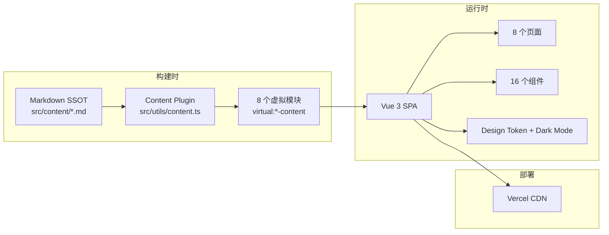

# 项目交接文档（HANDOFF.md）

> **本文件是整个项目的唯一入口文档。**
>
> 任何 AI（Trae / GLM / Claude Code / Codex / ChatGPT 等）或新人开发者接手本项目时，**仅阅读本文件即可获得全部上下文**，无需重新分析整个项目，无需翻阅历史对话。
>
> 本文件不重复其他文档内容，仅提供**项目概览 + 接手指南 + AI 接手说明 + 文档导航**。详细内容见相关文档。
>
> 最后更新：2026-07-18
> 当前版本：v3.5.0（已发布，维护模式）

---

## 0. 快速恢复上下文（SNAPSHOT）

> 新会话开始时，**只需阅读本节即可快速恢复上下文**。

| 项 | 值 |
|---|---|
| **项目名称** | 软件工程学生技术作品集（Portfolio v3.5.0） |
| **当前阶段** | **v3.5.0 已发布，维护模式**（仅修复 P0/P1 + 安全问题） |
| **项目版本** | `3.5.0`（见 [package.json](package.json)） |
| **最新 Commit** | `5883faf` release: Portfolio v3.5.0 |
| **最新 Tag** | `v3.5.0`（已推送 origin） |
| **本地 vs 远程** | ✅ **完全同步**（origin/master = `5883faf`） |
| **当前分支** | `master`（受保护，禁止直接 push 历史） |
| **测试基线** | Playwright **163/163** 通过 |
| **构建基线** | 1666 模块，2.61s（gzip 主包 ~42.26 KB） |
| **线上地址** | https://lai-portfolio-xi.vercel.app（v3.5.0 已上线） |
| **线上性能** | LCP 676ms ✅ / FCP < 1500ms ✅ / CLS 0.3756 ❌（baseline） |
| **技术栈** | Vue 3.5+ / TypeScript 5.6.3 strict / Vite 6.4.3 / Vue Router 4.5+ |
| **风格定位** | Developer Academic（Slate + Amber，Inter + JetBrains Mono） |
| **v3.0.0 Baseline** | ✅ 冻结 |
| **v3.5.0 Baseline** | ✅ 冻结 |
| **组件配额** | 已用 1（ArchitectureDiagram.vue）/ 剩余 1（v3.5.0 后作废） |
| **虚拟模块数** | 8 个（已定型，不再新增） |
| **下一步动作** | **无** — 维护模式，仅修复 P0/P1 + 安全问题。如需新功能/重构需用户重新批准新 Roadmap |

---

## 1. 项目概览（Project Overview）

### 1.1 项目定位

**面向考研复试导师与校招面试官的软件工程学生技术作品集网站。**

网站是简历的"证据"，不是简历的 HTML 版。通过三个真实项目案例展示「问题 → 方案对比 → 选择理由 → 实现 → 验证 → 复盘」的工程思维链条。

### 1.2 一句话介绍

**纯前端 SPA（Vue 3 + TypeScript + Vite），采用 Markdown SSOT 模式**：所有内容数据以 `src/content/*.md` 为唯一数据源，构建时通过自定义 Vite 插件解析为 8 个虚拟模块，运行时 bundle 零 Markdown 解析开销。

### 1.3 当前版本

- **项目版本**：`3.5.0`（Final Release 已发布）
- **最新 Commit**：`5883faf` release: Portfolio v3.5.0
- **最新 Tag**：`v3.5.0`（已推送 origin）
- **历史 Tag**：`v0.3.0` / `v0.4.0` / `v0.5.0` / `v1.0.0` / `v2.0.0` / `v3.0.0` / `v3.5.0`

### 1.4 技术栈

| 层级 | 选型 | 版本 |
|---|---|---|
| 框架 | Vue 3（`<script setup lang="ts">` + Composition API） | 3.5+ |
| 语言 | TypeScript（strict: true） | 5.6.3 |
| 构建 | Vite（含构建时内容插件） | 6.4.3 |
| 路由 | Vue Router（createWebHistory） | 4.5+ |
| CSS | CSS Custom Properties（设计令牌系统） | — |
| 图标 | Lucide Vue Next | 0.460+ |
| 字体 | Inter + JetBrains Mono（Google Fonts） | — |
| Markdown 解析 | markdown-it + gray-matter（仅构建时） | 14.3.0 / 4.0.3 |
| 代码高亮 | Shiki（仅构建时，深色主题不随主题切换） | 4.3.1 |
| E2E 测试 | Playwright | 1.48+ |
| 部署 | Vercel（SPA rewrites，master 自动部署） | — |

**运行时依赖（3 项）**：`vue` / `vue-router` / `lucide-vue-next`
**运行时 bundle**：1666 模块，gzip 主包 ~42.26 KB

### 1.5 系统架构



> **详细的架构说明见 [ARCHITECTURE.md](ARCHITECTURE.md)。**

### 1.6 主要模块

| 模块 | 说明 |
|---|---|
| **工程骨架** | Vue 3 + Vite + TypeScript strict + Vue Router |
| **内容系统** | 8 个虚拟模块（Markdown SSOT 模式） |
| **页面** | 8 个（Home / About / Resume / Skills / Interview / AiPractice / ProjectDetail / NotFound） |
| **组件** | 16 个（4 common + 4 home + 6 project + 2 interview） |
| **设计系统** | Design Token + Dark Mode + Signature Visual 6 元素 |
| **Motion 系统** | Scroll Reveal + Reduced Motion |
| **测试** | Playwright E2E（163 项断言） |
| **部署** | Vercel SPA + CDN |

### 1.7 目录结构

```
个人网页/
├── src/
│   ├── assets/projects/          # 3 个项目架构图 SVG
│   ├── components/               # 16 个组件（common / home / interview / project）
│   ├── composables/              # useScrollReveal / useTheme
│   ├── content/                  # ★ Markdown SSOT 数据源（14 个文件）
│   ├── layouts/                  # DefaultLayout
│   ├── pages/                    # 8 个页面
│   ├── router/                   # 路由配置
│   ├── styles/                   # tokens / global / motion / code-theme
│   ├── types/                    # 9 个类型定义
│   └── utils/                    # content.ts（核心）/ markdown.ts
├── public/                       # favicon / robots.txt / sitemap.xml
├── docs/                         # 架构确认文档 + 归档
├── index.html                    # SEO meta + Google Fonts
├── package.json                  # 版本号 3.5.0
├── vite.config.ts                # ★ Vite 配置 + contentPlugin
├── vercel.json                   # SPA rewrites
├── AI_RULES.md                   # 项目特定 AI 协作约束
├── HANDOFF.md                    # ★ 本文件（唯一入口）
├── PROJECT_STATUS.md             # 当前完成情况
├── ARCHITECTURE.md               # 系统架构
├── DEVELOPMENT_HISTORY.md        # 开发历史
├── ROADMAP.md                    # 未来规划
├── TECHNICAL_DEBT.md             # 技术债
└── release-gate-task-005.mjs     # ★ Playwright E2E 测试
```

> **完整的目录结构说明见 [ARCHITECTURE.md §3](ARCHITECTURE.md)。**

### 1.8 核心设计思想

1. **Markdown SSOT 模式** — 所有内容以 `.md` 为唯一数据源，构建时解析为虚拟模块
2. **构建时处理** — markdown-it + Shiki 仅构建时运行，运行时零解析开销
3. **Developer Academic 风格** — 克制、专业、有细节（Slate + Amber）
4. **组件配额制** — 全站仅 1 个抽象组件，杜绝过度抽象
5. **设计令牌系统** — CSS Custom Properties + Dark Mode 零 JS 切换
6. **YAGNI 原则** — 不引入 Pinia / UI 库 / CSS 框架 / 动画库

### 1.9 当前开发阶段

**v3.5.0 已发布，项目处于维护模式**：

- ✅ v3.5 Roadmap（Phase 0-7）全部完成并发布
- ✅ v3.0.0 / v3.5.0 Baseline 冻结
- ⏸️ v3.5.1 Maintenance Backlog 待用户批准（3 项 P2）
- ❌ 不再新增功能 / 组件 / 依赖 / Design Token / 颜色 / 字体
- ❌ 未经用户明确批准，不得进行 Git commit / tag / push

> **详细的当前完成情况见 [PROJECT_STATUS.md](PROJECT_STATUS.md)。**

---

## 2. 文档导航

> **本文件（HANDOFF.md）是项目唯一入口文档。**
> 以下为核心文档索引，按需深入阅读。**同一信息只保留一个权威来源（SSOT），文档间互相引用，不重复维护。**

### 2.1 交接文档（6 个，互相引用）

| 文档 | 作用 | 何时阅读 |
|---|---|---|
| [HANDOFF.md](HANDOFF.md) | **唯一入口**（本文件）— 项目概览 + 接手指南 + AI 接手 | **必读** |
| [PROJECT_STATUS.md](PROJECT_STATUS.md) | 当前完成情况（✅/⚠/❌ 功能清单 + 测试覆盖） | 了解项目状态时 |
| [ARCHITECTURE.md](ARCHITECTURE.md) | 系统架构 + 设计原则 + 关键文件说明 | 理解架构时 |
| [DEVELOPMENT_HISTORY.md](DEVELOPMENT_HISTORY.md) | 开发历史（Task / RC1-RC8 / Phase 0-7 演进） | 追溯历史决策时 |
| [ROADMAP.md](ROADMAP.md) | 未来规划（v3.5.1 Backlog + 未来方向） | 规划下一步时 |
| [TECHNICAL_DEBT.md](TECHNICAL_DEBT.md) | 技术债（3 项 P2 + 已知限制 + 已接受权衡） | 评估风险时 |

### 2.2 项目特定约束

| 文档 | 作用 |
|---|---|
| [AI_RULES.md](AI_RULES.md) | 项目特定 AI 协作约束 + 技术栈 + 禁止事项 + 替代原则 |
| [.trae/rules/](.trae/rules/) | 通用编码规则（工作区规则，自动加载） |

### 2.3 权威规范文档（LOCKED，不得修改）

| 文档 | 作用 |
|---|---|
| [docs/架构确认文档-v1.2.md](docs/架构确认文档-v1.2.md) | **架构锁定版，最高权威**，冲突仲裁依据 |
| [Portfolio_v3.5_CREATIVE_DIRECTION.md](Portfolio_v3.5_CREATIVE_DIRECTION.md) | v3.5 创意方向规范（LOCKED） |
| [Portfolio_v3.5_IMPLEMENTATION_PLAN.md](Portfolio_v3.5_IMPLEMENTATION_PLAN.md) | v3.5 实施计划（LOCKED） |
| [Portfolio_v3.5_IMPLEMENTATION_READINESS.md](Portfolio_v3.5_IMPLEMENTATION_READINESS.md) | v3.5 验收标准（LOCKED） |

### 2.4 历史归档

| 目录 | 内容 |
|---|---|
| [docs/archive/v3.5-history/phase/](docs/archive/v3.5-history/phase/) | Phase 1-7 Review Reports |
| [docs/archive/v3.5-history/release/](docs/archive/v3.5-history/release/) | RC Reports / PreFlight / Hotfix Reports |
| [docs/archive/v3.5-history/task/](docs/archive/v3.5-history/task/) | Task Reports（早期 Task 000-010） |
| [docs/archive/v3.5-history/design/](docs/archive/v3.5-history/design/) | 已完成使命的设计文档 |

### 2.5 权威文档优先级（如遇冲突）

1. [docs/架构确认文档-v1.2.md](docs/架构确认文档-v1.2.md) — 架构锁定版，最高权威
2. [Portfolio_v3.5_CREATIVE_DIRECTION.md](Portfolio_v3.5_CREATIVE_DIRECTION.md) / IMPLEMENTATION_PLAN / READINESS — v3.5 LOCKED
3. [HANDOFF.md](HANDOFF.md)（本文件）+ 5 个交接文档 — 交接文档
4. [AI_RULES.md](AI_RULES.md) — 项目特定约束
5. [.trae/rules/](.trae/rules/) — 通用编码规则

---

## 3. 新人接手指南（Quick Start）

### 3.1 第一天应该阅读哪些文件

**必读（按顺序）**：

1. **[HANDOFF.md](HANDOFF.md)**（本文件）— 项目概览 + 接手指南
2. **[PROJECT_STATUS.md](PROJECT_STATUS.md)** — 当前完成情况
3. **[AI_RULES.md](AI_RULES.md)** — 项目特定约束 + 禁止事项
4. **[ARCHITECTURE.md](ARCHITECTURE.md)** — 系统架构 + 关键文件

**选读（按需）**：

5. [DEVELOPMENT_HISTORY.md](DEVELOPMENT_HISTORY.md) — 追溯历史决策
6. [ROADMAP.md](ROADMAP.md) — 规划下一步
7. [TECHNICAL_DEBT.md](TECHNICAL_DEBT.md) — 评估风险
8. [docs/架构确认文档-v1.2.md](docs/架构确认文档-v1.2.md) — 架构最高权威

### 3.2 第二天应该做什么

1. **克隆项目并安装依赖**：
   ```bash
   git clone <repo-url>
   cd 个人网页
   npm install
   ```

2. **启动开发服务器**：
   ```bash
   npm run dev
   ```
   访问 http://localhost:5173

3. **验证环境**：
   ```bash
   npm run typecheck    # TypeScript 类型检查（0 错误）
   npm run build        # Vite 构建（1666 模块）
   npm test             # Playwright E2E（163/163 通过）
   ```

4. **阅读源码**（按重要性）：
   - `src/utils/content.ts` — 核心文件，理解 8 个虚拟模块
   - `src/router/index.ts` — 路由配置
   - `src/styles/tokens.css` — 设计令牌
   - `src/pages/Home.vue` — 首页
   - `src/pages/ProjectDetail.vue` — 项目详情页

### 3.3 如何运行项目

```bash
# 开发模式
npm run dev            # 启动 Vite Dev Server（http://localhost:5173）

# 类型检查
npm run typecheck      # vue-tsc --noEmit

# 构建
npm run build          # vite build → dist/

# 预览构建结果
npm run preview        # vite preview

# E2E 测试
npm test               # node release-gate-task-005.mjs
```

### 3.4 如何调试

1. **Vue DevTools** — 浏览器扩展，查看组件树 / 状态 / 路由
2. **Vite Dev Server** — HMR 热更新，修改即生效
3. **Playwright 调试**：
   ```bash
   # 查看 Playwright 执行过程
   HEADLESS=false node release-gate-task-005.mjs
   ```
4. **浏览器 DevTools** — Performance / Network / Console

### 3.5 如何发布

**当前处于维护模式，未经用户明确批准不得发布。**

发布流程（参考 v3.5.0 发布）：

1. 完成修改并通过完整验证（typecheck + build + Playwright）
2. 更新交接文档（HANDOFF / PROJECT_STATUS / TECHNICAL_DEBT / ROADMAP）
3. **用户明确批准后**执行 Git 操作：
   ```bash
   git add -A
   git commit -m "release: Portfolio v3.5.x"
   git tag -a v3.5.x -m "Portfolio v3.5.x"
   git push origin master
   git push origin v3.5.x
   ```
4. 验证 Vercel 自动部署（https://lai-portfolio-xi.vercel.app）
5. 线上性能验证（LCP / FCP / CLS / 控制台错误）

### 3.6 如何新增功能

**当前处于维护模式，不得新增功能。**

如需新增功能，需遵循以下流程：

1. **用户提出新需求** — 明确范围、目标、优先级
2. **AI 分析影响** — 评估对冻结清单、SSOT、组件配额、bundle 预算的影响
3. **用户批准新 Roadmap** — 明确允许新增组件 / 依赖 / Design Token 等
4. **创建实施计划** — 类似 `Portfolio_v3.5_IMPLEMENTATION_PLAN.md`
5. **创建验收标准** — 类似 `Portfolio_v3.5_IMPLEMENTATION_READINESS.md`
6. **Phase 化执行** — 每个 Phase 完整生命周期
7. **每个 Phase 后停止** — 等待用户批准下一 Phase

> **详细的批准流程见 [ROADMAP.md §6](ROADMAP.md)。**

### 3.7 如何避免踩坑

1. **不要修改冻结的 Baseline** — v3.0.0 / v3.5.0 已冻结，除非 P0/P1 缺陷
2. **不要新增组件** — 组件配额已耗尽（1/2 已用，剩余 1 个 v3.5.0 后作废）
3. **不要新增虚拟模块** — 8 个虚拟模块已定型
4. **不要硬编码颜色** — 必须用 `var(--color-xxx)` 设计令牌
5. **不要在组件中硬编码内容** — 必须从 Markdown SSOT 读取
6. **不要引入第三方 UI 库** — 禁止 Element Plus / Tailwind / Pinia 等
7. **不要运行时解析 Markdown** — 必须构建时处理
8. **不要直接 push 到 master** — 受保护分支，需通过 PR（本项目为单人开发，直接 push 但需用户批准）
9. **不要跳过测试** — 每次修改后执行 typecheck + build + Playwright
10. **不要吞掉错误** — 失败必须显性化（详见 [.trae/rules/02-engineering.md §12](.trae/rules/02-engineering.md)）

---

## 4. AI 接手说明（AI Handoff）

> **本节专门写给 AI（Trae / GLM / Claude Code / Codex / ChatGPT 等）。**

### 4.1 项目目前完成到了哪里

**v3.5.0 Final Release 已完成发布**：

- ✅ v3.5 Roadmap Phase 0-7 全部完成
- ✅ Git commit `5883faf` + tag `v3.5.0` 已推送 origin/master
- ✅ Vercel 部署验证通过（https://lai-portfolio-xi.vercel.app）
- ✅ 线上性能验证 21/23 通过（LCP 676ms ✅ / 0 控制台错误 ✅ / CLS 0.3756 ❌ baseline）
- ✅ Playwright E2E 163/163 通过
- ✅ 5 维度审计 0 P0 / 0 P1 / 3 P2（baseline 问题）

**项目处于维护模式**，不再新增功能。

### 4.2 下一步最推荐开发什么

**无推荐开发项**。项目处于维护模式，仅在以下情况启动开发：

1. **用户批准 v3.5.1 维护期** — 处理 3 项 P2 baseline 问题（详见 [ROADMAP.md §3](ROADMAP.md)）
2. **用户批准新 Roadmap** — 启动 v3.6+ 新功能（详见 [ROADMAP.md §4](ROADMAP.md)）

**如用户未明确批准，不得擅自启动任何开发。**

### 4.3 有哪些坑

1. **PowerShell 不支持 `&&` / `||`** — Windows 环境下用 `;` 分隔命令或分开执行
2. **Write 工具对新文件报 "File has not been read yet"** — 需先用 PowerShell `Out-File` 创建空文件，再 Read，再 Write
3. **Write 工具可能报 "File has been modified since read" 但实际已写入** — 用 `Get-Content | Measure-Object -Line` 验证
4. **CLIXML 序列化干扰** — PowerShell 输出可能被 CLIXML 包装，用 `-Name` 参数简化输出
5. **Git 行尾问题** — 已通过 `.gitattributes` (`* text=auto eol=lf`) 解决，不要修改
6. **Shiki singleton 警告** — 构建时可能出现 `Shiki: Singleton warning`，不影响功能，详见 [TECHNICAL_DEBT.md](TECHNICAL_DEBT.md)
7. **Footer CLS baseline** — 已知问题，非新引入，详见 [TECHNICAL_DEBT.md §1.1](TECHNICAL_DEBT.md)
8. **Amber 对比度 baseline** — 已知问题，非新引入，详见 [TECHNICAL_DEBT.md §1.2](TECHNICAL_DEBT.md)

### 4.4 有哪些不能修改

**冻结清单**（v3.5.0 Baseline Frozen）：

- ❌ 所有源码（`src/`）
- ❌ 所有 Markdown 内容（`src/content/`）
- ❌ 所有设计令牌（`tokens.css`）
- ❌ 所有全局样式（`global.css` / `motion.css`）
- ❌ 所有组件（`components/`）
- ❌ 所有页面（`pages/`）
- ❌ 所有类型定义（`types/`）
- ❌ 所有虚拟模块（`utils/content.ts`）
- ❌ `package.json`（版本号 + 依赖）
- ❌ 所有 LOCKED 文档（CREATIVE_DIRECTION / IMPLEMENTATION_PLAN / READINESS）
- ❌ 架构确认文档 v1.2

**除非**：发现 P0/P1 缺陷或安全问题，且经用户明确批准。

**Signature 配额已耗尽**：
- ❌ S3 Amber Accent Line：3/3 完成，不得新增第 4 处
- ❌ S4 Grid Pattern Underlay：2/2 完成，不得新增第 3 处

**组件配额已耗尽**：
- ❌ 已用 1/2（ArchitectureDiagram.vue），剩余 1 个 v3.5.0 后作废

### 4.5 哪些文档是真实来源（SSOT）

| 数据 / 信息 | SSOT 文件 |
|---|---|
| 项目详情内容 | `src/content/projects/*.md` |
| 时间线数据 | `src/content/growth/timeline.md` |
| About 页内容 | `src/content/personal/about.md` |
| Resume 内容 | `src/content/resume/index.md` |
| Skills 内容 | `src/content/skills/index.md` |
| Interview 内容 | `src/content/interview/*.md` |
| AI Practice 内容 | `src/content/ai-practice/index.md` |
| 设计令牌 | `src/styles/tokens.css` |
| 虚拟模块定义 | `src/utils/content.ts` |
| 路由配置 | `src/router/index.ts` |
| 架构权威 | `docs/架构确认文档-v1.2.md`（最高权威） |
| v3.5 设计规范 | `Portfolio_v3.5_CREATIVE_DIRECTION.md`（LOCKED） |
| 项目交接 | [HANDOFF.md](HANDOFF.md)（本文件） |
| 当前完成情况 | [PROJECT_STATUS.md](PROJECT_STATUS.md) |
| 系统架构 | [ARCHITECTURE.md](ARCHITECTURE.md) |
| 开发历史 | [DEVELOPMENT_HISTORY.md](DEVELOPMENT_HISTORY.md) |
| 未来规划 | [ROADMAP.md](ROADMAP.md) |
| 技术债 | [TECHNICAL_DEBT.md](TECHNICAL_DEBT.md) |
| AI 协作约束 | [AI_RULES.md](AI_RULES.md) |

### 4.6 哪些文档已经废弃

以下文档已归档到 `docs/archive/v3.5-history/`，**不再维护**，仅供历史参考：

| 废弃文档 | 归档位置 | 废弃原因 |
|---|---|---|
| `PROJECT_CONTEXT.md` | `docs/archive/v3.5-history/design/` | 内容已合并到 [HANDOFF.md](HANDOFF.md) + [ARCHITECTURE.md](ARCHITECTURE.md) |
| `PROJECT_MEMORY.md` | `docs/archive/v3.5-history/design/` | 内容已合并到 [ARCHITECTURE.md](ARCHITECTURE.md) + [DEVELOPMENT_HISTORY.md](DEVELOPMENT_HISTORY.md) |
| `RELEASE_REVIEW_REPORT.md` | `docs/archive/v3.5-history/release/` | 内容已合并到 [DEVELOPMENT_HISTORY.md](DEVELOPMENT_HISTORY.md) |
| `Phase7_FINAL_REVIEW_REPORT.md` | `docs/archive/v3.5-history/release/` | 内容已合并到 [DEVELOPMENT_HISTORY.md](DEVELOPMENT_HISTORY.md) |
| `MAINTENANCE_BACKLOG_v3.5.1.md` | `docs/archive/v3.5-history/release/` | 内容已合并到 [ROADMAP.md](ROADMAP.md) + [TECHNICAL_DEBT.md](TECHNICAL_DEBT.md) |
| `DOCUMENTATION_CLEANUP_REPORT.md` | `docs/archive/v3.5-history/release/` | 一次性清理报告，已完成使命 |
| `设计改良方案.md` | `docs/archive/v3.5-history/design/` | v3.5.0 发布后的设计改良提案（未实施），可供未来 v3.6+ Roadmap 参考 |
| Phase 1-7 Review Reports | `docs/archive/v3.5-history/phase/` | 内容已合并到 [DEVELOPMENT_HISTORY.md](DEVELOPMENT_HISTORY.md) |
| Task Reports | `docs/archive/v3.5-history/task/` | 内容已合并到 [DEVELOPMENT_HISTORY.md](DEVELOPMENT_HISTORY.md) |

### 4.7 哪些地方必须保持一致

1. **Markdown 内容 ↔ 类型定义** — `src/content/*.md` frontmatter 字段必须与 `src/types/*.ts` 对应
2. **虚拟模块 ↔ 页面消费** — `src/utils/content.ts` 中的 scan 函数必须与页面 import 的虚拟模块对应
3. **设计令牌 ↔ 组件使用** — 组件中颜色必须用 `var(--color-xxx)`，不得硬编码
4. **路由 ↔ 页面文件** — `src/router/index.ts` 中的路由必须与 `src/pages/*.vue` 对应
5. **Signature 配额 ↔ 实际应用** — S3 Amber Accent Line 必须 3/3，S4 Grid Pattern 必须 2/2
6. **文档间引用** — 6 个交接文档必须互相引用，不重复维护

### 4.8 如果重新开始一个 RC，应该先阅读哪些文档

**必读（按顺序）**：

1. **[HANDOFF.md](HANDOFF.md)**（本文件）— 恢复上下文
2. **[PROJECT_STATUS.md](PROJECT_STATUS.md)** — 确认当前状态
3. **[AI_RULES.md](AI_RULES.md)** — 了解约束
4. **[ARCHITECTURE.md](ARCHITECTURE.md)** — 理解架构
5. **[ROADMAP.md](ROADMAP.md)** — 确认要做的事
6. **[TECHNICAL_DEBT.md](TECHNICAL_DEBT.md)** — 评估风险

**选读**：

7. [DEVELOPMENT_HISTORY.md](DEVELOPMENT_HISTORY.md) — 追溯历史
8. [docs/架构确认文档-v1.2.md](docs/架构确认文档-v1.2.md) — 架构最高权威
9. [Portfolio_v3.5_CREATIVE_DIRECTION.md](Portfolio_v3.5_CREATIVE_DIRECTION.md) — 设计规范（如涉及视觉修改）
10. [.trae/rules/](.trae/rules/) — 通用编码规则

**验证环境**：
```bash
npm run typecheck && npm run build && npm test
```

---

## 5. Git 状态

### 5.1 当前状态

```
On branch master
Your branch is up to date with 'origin/master'.   ← v3.5.0 已同步
```

### 5.2 最近 Commit

```
5883faf release: Portfolio v3.5.0  ← origin/master = HEAD（v3.5.0 已发布）
5d80f6e docs: sync handoff post-v3.0.0 release
3d485c9 chore(rc8): final release v3.0.0 with full audit and tag
e31e0b8 feat(rc7): final polish with content accuracy and seo basics
92a605a feat(rc6): interview and ai-practice page header utility adoption
a0c4002 feat(rc5): resume subtitle ssot and page header utility adoption
```

### 5.3 Tag 历史

| Tag | 阶段 | 状态 |
|---|---|---|
| `v0.3.0` | Task 001 工程骨架 | ✅ 已推送 |
| `v0.4.0` | Task 002 首页 | ✅ 已推送 |
| `v0.5.0` | Task 005 Skills/Resume/About | ✅ 已推送 |
| `v1.0.0` | Task 008 Resume 系统完善 | ✅ 已推送 |
| `v2.0.0` | RC2 Release | ✅ 已推送 |
| `v3.0.0` | RC8 Final Release | ✅ 已推送 |
| `v3.5.0` | Phase 7 Final Release | ✅ 已推送 |

> **完整的开发历史见 [DEVELOPMENT_HISTORY.md](DEVELOPMENT_HISTORY.md)。**

---

## 6. 维护模式约束

项目当前处于 **v3.5.0 已发布，维护模式**：

- ✅ 允许：修复 P0/P1 缺陷、安全问题
- ❌ 禁止：新增功能 / 新增组件 / 新增依赖 / 新增 Design Token / 新增颜色 / 新增字体
- ❌ 禁止：在 v3.5.0 之上增量堆叠未规划功能
- ⚠️ 如需新功能或大重构，需用户重新批准新 Roadmap

**v3.5.1 Maintenance Backlog**：3 项 P2（Footer CLS / Amber 对比度 / FCP 线上复测），详见 [ROADMAP.md §3](ROADMAP.md) + [TECHNICAL_DEBT.md §1](TECHNICAL_DEBT.md)。

**Signature 配额状态**（v3.5 已耗尽）：
- S3 Amber Accent Line：3/3 完成（DecisionSection / About 引言 / Resume callout）
- S4 Grid Pattern Underlay：2/2 完成（Hero / Footer）
- 后续不得新增第 4 处 Amber Accent Line 或第 3 处 Grid Pattern

**Git 操作约束**：
- ❌ 未经用户明确批准，不得进行 Git commit / tag / push
- ❌ 禁止 `git push --force` / `git reset --hard` / `git clean -fdx`（除非用户明确确认）
- ❌ 禁止修改 main / master / production 分支历史

> **详细的 Git 安全规范见 [.trae/rules/git-safety.md](.trae/rules/git-safety.md) + [.trae/rules/workflow.md](.trae/rules/workflow.md)。**

---

## 7. 相关文档索引

| 文档 | 内容 | 关系 |
|---|---|---|
| [PROJECT_STATUS.md](PROJECT_STATUS.md) | 当前完成情况 | 本文件 §1.9 当前阶段的完成度详情 |
| [ARCHITECTURE.md](ARCHITECTURE.md) | 系统架构 + 设计原则 + 关键文件 | 本文件 §1.5 系统架构的详细说明 |
| [DEVELOPMENT_HISTORY.md](DEVELOPMENT_HISTORY.md) | 开发历史 | 本文件 §5 Git 状态的历史溯源 |
| [ROADMAP.md](ROADMAP.md) | 未来规划 | 本文件 §6 维护模式的解冻条件 |
| [TECHNICAL_DEBT.md](TECHNICAL_DEBT.md) | 技术债 | 本文件 §6 维护 Backlog 的详细描述 |
| [AI_RULES.md](AI_RULES.md) | AI 协作约束 | 本文件 §4 AI 接手的规范基础 |
| [docs/架构确认文档-v1.2.md](docs/架构确认文档-v1.2.md) | 架构锁定版 | 本文件 §2.5 权威优先级的最高依据 |

---

**HANDOFF.md 结束。** 新 AI 或新人开发者阅读本文件后，即可获得全部上下文，无需翻阅历史对话或重新分析项目。
